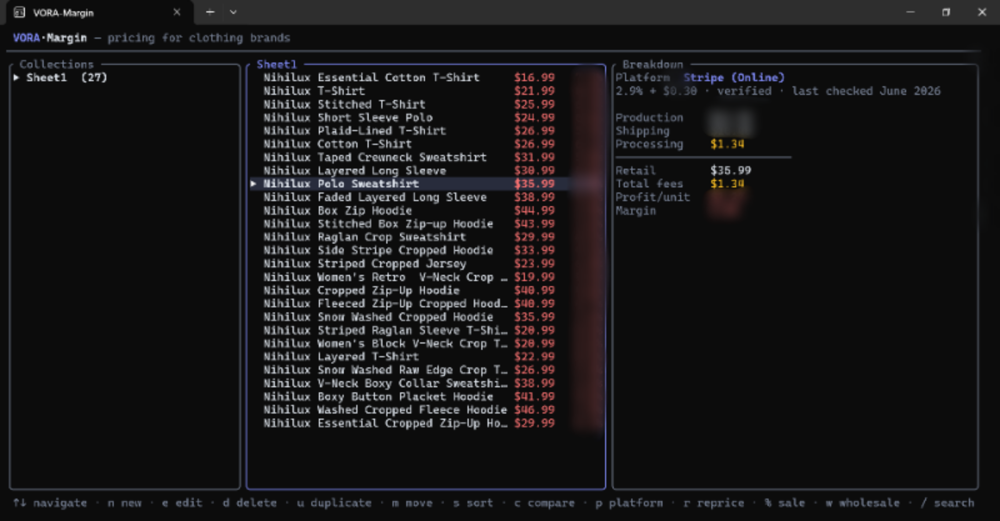

# VORA-Margin



A TUI app that replaces the pricing spreadsheet for clothing
brands. Organize products into collections, pick the platform you sell on
(Stripe, Depop, Etsy, Vinted, Poshmark...), and instantly see your real
margin after every fee. Everything is stored locally, meaning no account and no cloud.

## Run it

```sh
cargo run
```

Build an optimized binary:

```sh
cargo build --release
# -> target/release/vora-margin(.exe)
```

## Keys

| Key | Action |
| --- | --- |
| `↑ ↓` / `j k` | Move selection |
| `Tab` / `← →` | Switch panes |
| `Enter` | Open collection / edit product |
| `n` | New collection or product |
| `e` | Edit / rename |
| `d` | Delete (with confirmation) |
| `u` | Duplicate product |
| `m` | Move product to another collection |
| `s` | Cycle sort order |
| `c` | Compare this product across every platform |
| `p` | Change a product's platform |
| `r` | Reverse-price from a target margin |
| `%` | Sale scenario + fake-sale calculator |
| `w` | Wholesale view |
| `/` | Search across all products |
| `X` | Export a formatted spreadsheet (.xlsx) |
| `i` | Import a spreadsheet (map columns) |
| `f` | Manage fee presets |
| `g` | Settings (currency symbol) |
| `?` | Help |
| `Ctrl+C` | Quit |

## How pricing works

For each product you enter a production cost, retail price, and shipping
cost, then choose a platform. The margin is:

```
profit = retail - production - shipping - fees
margin = profit / retail
```

Fees are computed from the platform preset, which is a stack of
`percent-of-sale + flat` components (e.g. Stripe = 2.9% + $0.30; Etsy stacks a
transaction %, a processing %, and listing/processing flats). All money math
uses fixed-point decimals, so there are no floating-point rounding errors.

## Fee data

Built-in presets live in [`src/presets.rs`](src/presets.rs). Rates verified
against published pricing in June 2026 are marked `verified`. While the others are
marked `verify` and should be re-confirmed (fees change often and vary by
country). You can also add your own presets.

## Where your data lives

A single `store.json`, pretty-printed, under your OS data directory:

- **Windows:** `%APPDATA%\VORA\Margin\data\store.json`
- **macOS:** `~/Library/Application Support/com.VORA.Margin/store.json`
- **Linux:** `~/.local/share/margin/store.json`

Press `?` in the app to see the exact path on your machine.

## Project layout

| File | Responsibility |
| --- | --- |
| `src/main.rs` | Terminal setup + event loop |
| `src/app.rs` | App state machine + all key handling |
| `src/ui.rs` | Rendering (panes, forms, overlays) |
| `src/model.rs` | Data types (`Store`, `Collection`, `Product`, fees) |
| `src/calc.rs` | Pricing engine (+ unit tests) |
| `src/presets.rs` | Built-in fee presets |
| `src/storage.rs` | Local JSON load/save |
| `src/textfield.rs` | Minimal text input widget |
| `src/util.rs` | Money parsing / formatting |

## Tech

Rust · [ratatui](https://ratatui.rs) (TUI) · crossterm · serde · rust_decimal
